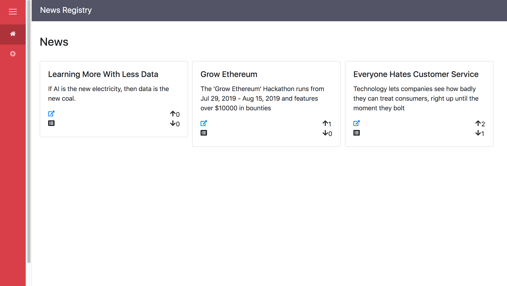
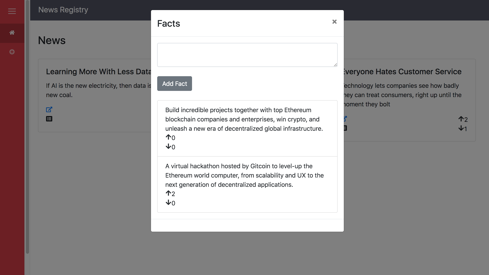
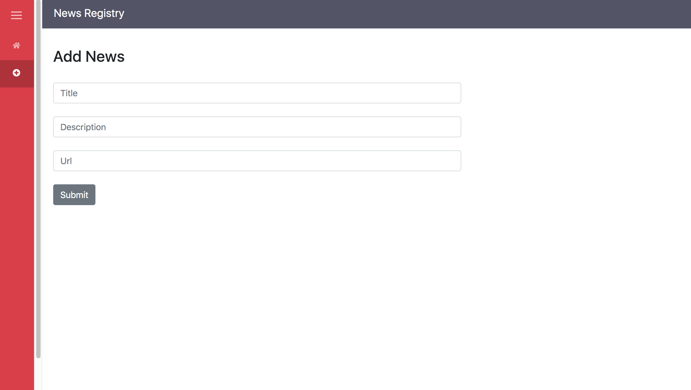

# News Registry

News Registry incentivizes fact checking and quality. It helps to build a curative reputation. It allows credit to be given to original sources.

## Screenshots

### News List


### Facts for a News


### Add News


## Getting Started

1) Clone Repo

    ```
    git clone https://github.com/viraja1/news_registry.git
    ```
    
2) Change directory
    
   ```
   cd news_registry/client
   ```

3)  Instant Deploy LlamaDB on Fluence
    
    Instant Deploy LlamaDB on Fluence and note down the 
    App config shown in the bottom right part of the App
    console (privateKey, contract, appId, ethereumUrl)
    ```
    http://dash.fluence.network/deploy
    ```  
   
4) Update Fluence LlamaDB app config

    Update Fluence LlamaDB app config in src/components/config.js
    
    ```
    vi src/components/config.js
    ```
5) Create tables using Fluence app console

    ```
    CREATE TABLE news(id int, user varchar(128), upVotes int, downVotes int, url varchar(1024), title varchar(1024), description varchar(2048))
    ```
    
    ```
    CREATE TABLE news_facts(id int, news_id int, user varchar(128), upVotes int, downVotes int,  text varchar(2048))
    ``` 

6) Build client app

    ```
    npm install
    ```
    
7) Start client app

    ```
    npm start
    ```
    
8) Open client app url in chrome

    ```
    http://localhost:8080
    ```
    
9) Install Metamask chrome extension

    ```
    https://chrome.google.com/webstore/detail/metamask/nkbihfbeogaeaoehlefnkodbefgpgknn?hl=en
    ```
    
10) Create account in metamask
     
11) Test the App

    Make sure that you have selected the right network using 
    metamask (Rinkeby). 
               